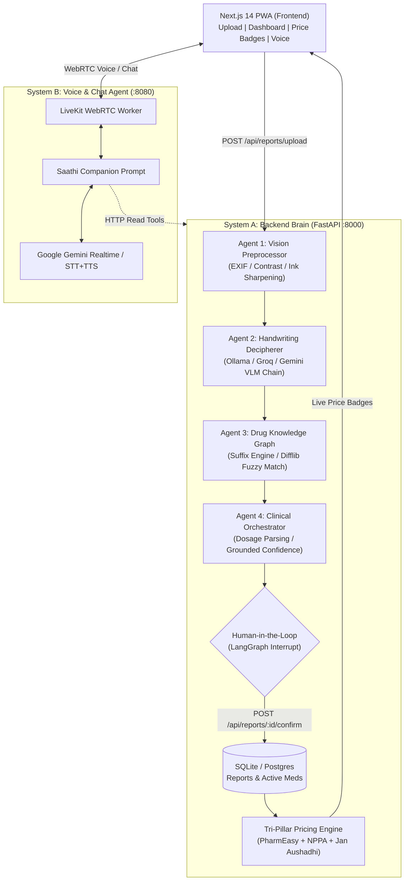
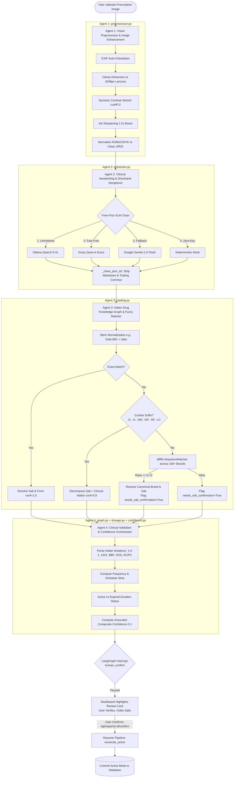
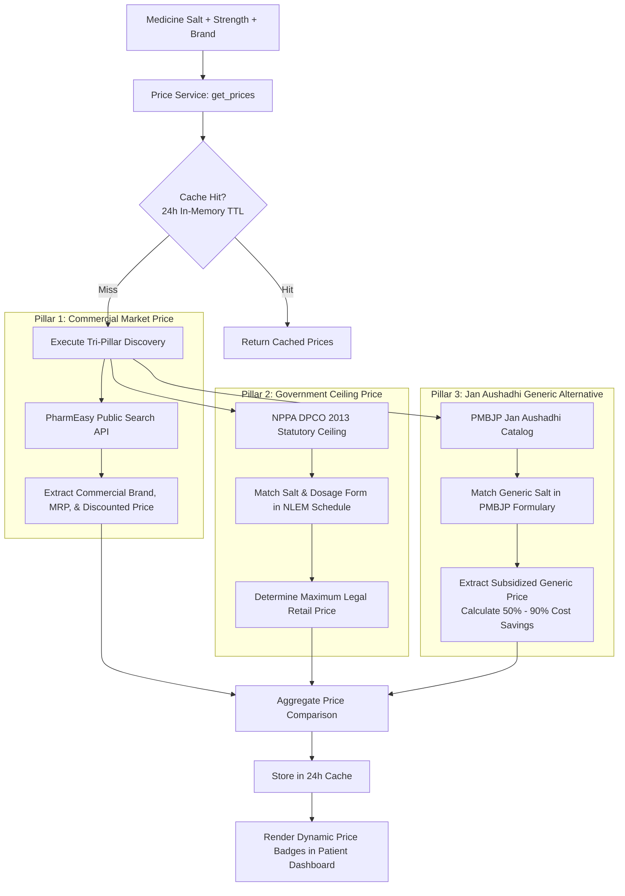
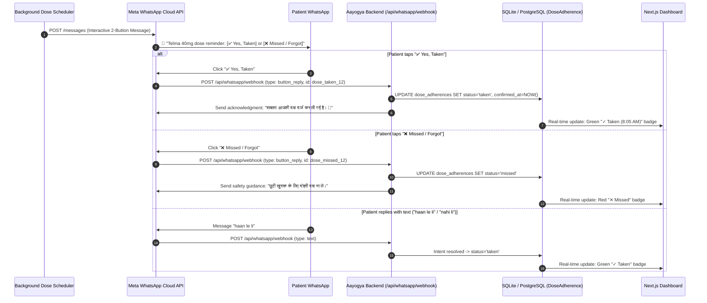

# Aayogya (आयोग्या)

> Click your prescription -> AI deciphers doctor handwriting, explains it in your language, flags cross-doctor drug interactions, compares real-time medicine prices across Jan Aushadhi & PharmEasy, and sends WhatsApp / voice reminders — while deferring every clinical decision to your real doctor.

**Aayogya** is an India-first medication-adherence and prescription-intelligence platform. It is deliberately **non-clinical**: under India's Telemedicine Practice Guidelines 2020 (§5.4), an AI platform may not diagnose or prescribe. Aayogya only *explains, navigates, compares prices, and reminds* — keeping every clinical decision in the hands of a registered medical practitioner.

Full architecture and compliance specifications live in [`DESIGN.md`](../DESIGN.md).

---

## Key Capabilities

- **4-Agent Handwriting Extraction Pipeline** — Multi-agent system that enhances smartphone photos, deciphers messy doctor cursive, fuzzy-matches against 100+ Indian drug brands, parses Indian dosage notations (`1-0-1`, `1/0/1`, `BBF`, `SOS`), and halts at a Human-in-the-Loop gate.
- **Tri-Pillar Medicine Pricing Engine** — Real-time price discovery comparing **PharmEasy** commercial rates, **NPPA (DPCO)** statutory ceiling prices, and **PMBJP Jan Aushadhi** generic store prices (up to 90% savings) with 24-hour caching.
- **Extraction Confidence Grounding** — Composite 0–1 confidence score based on external catalog validation, dosage parsability, and strength detection. Cursive approximations automatically trigger review flags.
- **Cross-Doctor Interaction Check** — The safety moat: detects salt-level interactions across *all* active prescriptions from different doctors that no individual physician can see.
- **Plain-Language Multilingual Explanations** — Clarifies why each medicine was prescribed in native Indian languages (Hindi, English, etc.).
- **Nearby Chemists & Jan Aushadhi Kendras** — Live OpenStreetMap / Overpass geolocation map of nearby retail and generic pharmacies.
- **Voice Companion (Saathi)** — Ultra-low latency voice companion powered by LiveKit and Gemini for daily adherence check-ins.

---

## System Architecture



---

## 1. The 4-Agent Extraction Pipeline

Handwritten Indian prescriptions are notorious for illegible doctor cursive, inconsistent dosage shorthand, and combination brand names. Aayogya solves this using a specialized **4-Agent LangGraph Pipeline**:



### Breakdown of the 4 Agents:

1. **Agent 1: Vision Preprocessor & Image Enhancement ([`app/preprocessor.py`](backend/app/preprocessor.py))**
   - **EXIF Auto-Orientation:** Fixes sideways or upside-down mobile phone photos automatically.
   - **Dynamic Contrast Stretching & Ink Sharpening:** Enhances faint ballpoint/gel pen strokes (`ImageEnhance.Sharpness(1.5)` and `ImageOps.autocontrast(cutoff=2)`), clearing gray paper shadows.
   - **Dimension Optimization:** Binds images to 2048px max dimension to prevent vision model memory overflow.
   - **Safety:** Handles RGBA/CMYK modes and gracefully recovers from corrupt image payloads without failing the request.

2. **Agent 2: Clinical Handwriting & Shorthand Decipherer ([`app/extraction.py`](backend/app/extraction.py))**
   - Uses an expert prompt tailored to Indian clinical handwriting (cursive loops, abbreviations, combination suffixes).
   - **Free-First Fallback Chain:** Ollama (`Qwen2.5-VL-7B`) $\to$ Groq (`Llama-4-Scout`) $\to$ HF Router $\to$ Gemini $\to$ Deterministic Mock.
   - **Defensive JSON Sanitizer:** `_clean_json_str` strips markdown backticks, conversational preamble, and trailing commas.

3. **Agent 3: Indian Drug Knowledge Graph & Fuzzy Matcher ([`app/catalog.py`](backend/app/catalog.py))**
   - Powered by a comprehensive knowledge base ([`indian_medicines.json`](backend/app/data/indian_medicines.json)) covering top prescribed Indian brands across all therapeutic classes.
   - **Suffix Clinical Engine:** Recognizes combination suffixes:
     - `-D` / `-DSR` $\to$ *+ Domperidone* (e.g., `Pan-D`)
     - `-H` $\to$ *+ Hydrochlorothiazide* (e.g., `Telma-H`)
     - `-AM` $\to$ *+ Amlodipine* (e.g., `Telma-AM`)
     - `-GP` $\to$ *+ Glimepiride* (e.g., `Glycomet-GP`)
     - `-SP` $\to$ *+ Serratiopeptidase* (e.g., `Zerodol-SP`)
     - `-LC` $\to$ *+ Levocetirizine* (e.g., `Montair-LC`)
   - **Fuzzy Matcher:** Uses `difflib.SequenceMatcher` to resolve cursive doctor misspellings (`"Agmntin"` $\to$ *Augmentin / Amoxicillin + Clav*, `"Dlo"` $\to$ *Dolo / Paracetamol*, `"Zerol-SP"` $\to$ *Zerodol-SP*).
   - **Safety Rule:** Every fuzzy match automatically triggers `needs_salt_confirmation = True` with an explanatory note.

4. **Agent 4: Clinical Validation & Confidence Orchestrator ([`app/graph.py`](backend/app/graph.py), [`app/dosage.py`](backend/app/dosage.py), [`app/confidence.py`](backend/app/confidence.py))**
   - **Indian Dosage Parser:** Translates Indian shorthand into precise daily schedules:
     - `1-0-1` / `1/0/1` $\to$ Morning + Night (2 doses/day)
     - `1-1-1` $\to$ Morning + Afternoon + Night (3 doses/day)
     - `BBF` / `empty stomach` $\to$ Morning Before BreakFast
     - `bedtime` / `HS` $\to$ Night
     - `SOS` / `PRN` $\to$ Marked as `prn=True` (never auto-scheduled)
   - **Grounded Confidence Scoring:** Blends catalog match certainty (40%), dosage parsability (20%), strength detection (10%), and model self-report (30%).
   - **Human-in-the-Loop Gate:** Interrupts LangGraph execution before any medicine is saved as active. The patient confirms or edits via the dashboard card, preventing misidentified medicines from entering interaction checks.

---

## 2. Tri-Pillar Medicine Pricing Engine

Aayogya integrates a **Tri-Pillar Pricing Engine** ([`app/prices.py`](backend/app/prices.py)) that gives patients total transparency over medicine costs across retail pharmacies and government generic initiatives with **zero paid API keys**:



### The Three Pricing Pillars:

| Pillar | Source | Description | Typical Savings |
|---|---|---|---|
| **1. Commercial Retail** | **PharmEasy Search API** | Live market price from major Indian online pharmacy (e.g., Dolo 650 ~₹30–34). | Baseline MRP & retail discounts |
| **2. Statutory Ceiling** | **NPPA (DPCO 2013)** | Official government ceiling price under the National List of Essential Medicines (NLEM). Legally caps the maximum price any pharmacy can charge. | Regulates high-cost branded drugs |
| **3. Generic Alternative** | **PMBJP Jan Aushadhi** | Pradhan Mantri Bhartiya Janaushadhi Pariyojana public generic catalog (e.g., Paracetamol 650mg at ~₹5.50 for 10 tablets). | **50% to 90% savings** |

### Patient Dashboard Display:
In the frontend dashboard ([`frontend/components/ui.js`](frontend/components/ui.js)), each medicine card displays a unified pricing badge:
- **Commercial Price:** e.g., `PharmEasy: ₹30.50`
- **Government Cap:** e.g., `NPPA Cap: ₹2.10/tab`
- **Jan Aushadhi Generic:** e.g., `Jan Aushadhi: ₹5.50 (Save 82%)`

---

## Repository Structure

```
Aayogya/
├── backend/               System A — FastAPI + LangGraph Backend Brain
│   ├── app/
│   │   ├── preprocessor.py   Agent 1: Vision Preprocessor & Image Enhancement
│   │   ├── extraction.py     Agent 2: Clinical Handwriting & VLM Decipherer
│   │   ├── catalog.py        Agent 3: Indian Drug Knowledge Graph & Suffix Engine
│   │   ├── dosage.py         Agent 4: Indian Dosage Notation Parser
│   │   ├── confidence.py     Composite Grounded Confidence Scorer
│   │   ├── graph.py          LangGraph HITL StateGraph Workflow
│   │   ├── prices.py         Tri-Pillar Pricing Engine (PharmEasy / NPPA / PMBJP)
│   │   ├── data/
│   │   │   └── indian_medicines.json  100+ Indian brands, salts & forms
│   │   ├── main.py           FastAPI Application & Endpoints
│   │   ├── models.py         SQLAlchemy Database Models
│   │   └── schemas.py        Pydantic v2 Request/Response Schemas
│   ├── test_multiagent_extraction.py  Comprehensive 4-Agent & LangGraph Test Suite
│   ├── test_dosage.py                 Dosage Parser Unit Tests
│   └── test_confidence.py             Confidence Scoring Unit Tests
├── frontend/              Patient Dashboard (Next.js 14 App Router, GSAP, Leaflet)
│   ├── app/page.js        Prescription Upload & Active Medication Manager
│   └── components/ui.js   Dynamic Price Badges & Review Cards
└── agent/                 System B — Voice Companion (LiveKit + Google Gemini)
    ├── voice.py           Realtime WebRTC Voice Worker
    └── chat.py            Text Chat Brain
```

---

---

## 3. Meta WhatsApp Cloud API & Interactive Adherence

Aayogya integrates direct 2-way medication adherence messaging via the **official Meta WhatsApp Business Cloud API (v21.0)** with **zero paid middleware or third-party fees**:



### Endpoints
- `GET /api/whatsapp/webhook`: Meta Webhook challenge handshake (`hub.challenge`).
- `POST /api/whatsapp/webhook`: Inbound button-clicks & natural language text replies.
- `POST /api/whatsapp/send-reminder`: Trigger outbound interactive WhatsApp reminder for a dose.
- `POST /api/whatsapp/simulate-reply`: Local testing simulation of patient tapping 'Yes' or 'Missed'.
- `GET /api/adherence/today`: Fetch today's schedule and adherence statuses.
- `GET /api/reminders/preferences`: Retrieve patient's auto-reminder & voice call settings.
- `POST /api/reminders/preferences`: Toggle WhatsApp auto-reminders, voice call reminders, and dose slot timings.
- `POST /api/medicines/{id}/stop`: Mark medicine as stopped/completed ("Patient is fit / healthy"), canceling all future reminders.
- `POST /api/medicines/{id}/resume`: Reactivate a previously completed/stopped medicine.
- `POST /api/medicines/{id}/toggle-reminders`: Pause or resume reminders for an individual medicine.
- `POST /api/reminders/trigger-check`: Trigger an immediate automated check across all patients and due doses.

### 4. Patient Privacy & Notification Fatigue Control
- **Master WhatsApp & Call Toggles:** Patients can pause automated WhatsApp nudges or Sahayak phone calls with a single click so they are never spammed.
- **"I'm Feeling Fit / Stop Medicine" Action:** When a patient recovers or completes their prescribed course, clicking *"Stop Medicine"* immediately halts all reminders, archives today's pending doses, and records the completion in their medical history.
- **Background Async Scheduler:** An automated background worker daemon (`start_reminder_scheduler_loop()`) monitors dose slot windows in Indian Standard Time (IST) and dispatches reminders only when auto-reminders are active.

> **Zero-Key Development Mode:** If `WHATSAPP_API_TOKEN` is not yet set in `.env`, the backend automatically runs in safe simulation mode, logging outbound payloads and permitting instant UI testing with zero errors.

---

## Quick Start

### 1. Backend (FastAPI + LangGraph) — Port 8000

```bash
cd backend

# Create and activate virtual environment
python -m venv .venv
.venv\Scripts\activate       # On Windows (or source .venv/bin/activate on macOS/Linux)

# Install dependencies
pip install -r requirements.txt

# Run migrations & launch server
python -m uvicorn app.main:app --reload --port 8000
```

> **Zero-Key Out of the Box:** The backend works immediately with zero API keys. Extraction defaults to the deterministic mock or local Ollama, and SQLite is used automatically.

### 2. Frontend (Next.js 14 PWA) — Port 3000

```bash
cd frontend

npm install
npm run dev
```

Visit **http://localhost:3000** in your browser. Upload any prescription photo (`.jpg`/`.png`) to watch the 4-agent pipeline and pricing engine in action.

---

## Testing & Verification

A comprehensive test suite verifies each agent and edge case:

```bash
cd backend
.venv\Scripts\activate

# Run comprehensive 4-agent pipeline test suite (EXIF, JSON sanitizing, fuzzy matching, LangGraph HITL)
python test_multiagent_extraction.py

# Run WhatsApp Meta Cloud API adherence and webhook test suite
python test_whatsapp.py

# Run unit tests
python test_dosage.py
python test_confidence.py
```

### Verified Test Cases:
- **Agent 1:** EXIF auto-rotation, RGBA transparency conversion, 2048px Lanczos downscaling, corrupt image handling.
- **Agent 2:** Markdown code block sanitization (````json ... ````), trailing comma removal, conversational wrapper extraction.
- **Agent 3:** Brand normalization (`"Dolo-650"` $\to$ `"dolo"`), combo suffix reasoning (`-D`, `-H`, `-AM`, `-GP`, `-SP`), cursive handwriting fuzzy matching (`"Agmntin"` $\to$ *Augmentin*).
- **Agent 4:** Indian notations (`1-0-1`, `1/0/1`, `BBF`, `SOS`, `empty stomach`), expired vs active statuses, negative duration edge cases.
- **LangGraph HITL:** State pauses at `human_confirm` interrupt and resumes smoothly upon confirmation.

---

## Disclaimer

Aayogya is **not a substitute for professional medical advice, diagnosis, or treatment**. Under India's Telemedicine Practice Guidelines 2020, Aayogya never prescribes medication or alters dosages. Always consult a registered medical practitioner with any health-related questions. In a medical emergency, call **108** immediately.
